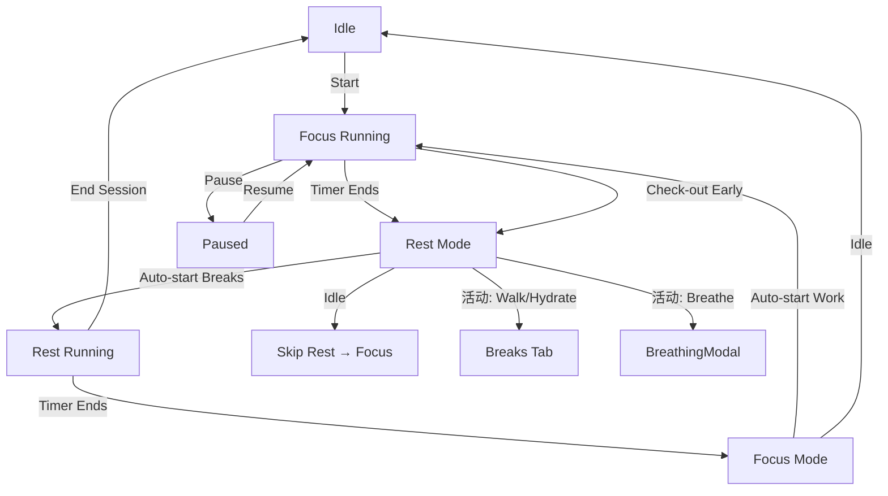

# Flowtime PRD

> **状态**: Draft | **日期**: 2025-06-26 | **版本**: v1.0

---

## 1. Executive Summary

Flowtime 是一个极简主义个人生产力计时器，围绕「专注/休息」节奏（类番茄工作法）构建。核心体验是：开始一段专注 Session → 计时结束自动切入休息 → 休息期间推荐活动（散步/喝水/拉伸/呼吸）→ 循环往复。所有人数据（Session 记录、UserProfile、Settings）持久化在 localStorage，零后端依赖，纯前端 SPA。视觉语言采用 **Liquid Round** 设计系统（极端圆角、固态不透明层次、Focus Red / Rest Green 双色状态体系）。

---

## 2. Problem Statement

### 谁有这个问题
需要保持深度工作节奏但缺乏结构化提醒的个人开发者/知识工作者。

### 什么问题
- 没有外力约束时，容易持续工作忘记休息（或相反，频繁被打断）；
- 休息质量无法追踪——不知道今天是站起来走了还是刷手机了；
- 缺乏可视化的「我今天到底专注了多久」的反馈。

### 为什么痛
- 长时间不休息 → 认知疲劳累积 → 下午效率断崖；
- 无记录 → 无法复盘和调整节奏；
- 现有番茄钟工具要么过于简单（只计时），要么过于复杂（需注册账号、数据分析）。

---

## 3. Target User

**单一用户**: 个人开发者（hzy），日常在电脑前工作，需要：
- 结构化 Focus/Rest 循环
- 休息期间有轻度引导（拉伸、喝水、呼吸）
- 本地数据，无账号系统
- 视觉干净、不打扰

---

## 4. Solution Overview

### 4.1 系统架构

```
┌─────────────────────────────────────────────────┐
│                    App.tsx                        │
│  ┌──────────┐ ┌──────────┐ ┌──────────┐ ┌──────┐│
│  │ TimerTab │ │HistoryTab│ │ BreaksTab│ │Set...││
│  └──────────┘ └──────────┘ └──────────┘ └──────┘│
│              ┌──────────────────┐                 │
│              │ BreathingModal   │                 │
│              └──────────────────┘                 │
│         localStorage (3 keys)                    │
│  flowtime_settings / _profile / _sessions        │
└─────────────────────────────────────────────────┘
```

- **TimerTab**: 计时器环形进度 + 专注/休息状态 + 任务标题
- **HistoryTab**: 今日 Session 时间线 + 统计卡 + 手动记录
- **BreaksTab**: 休息活动中心（散步/喝水/拉伸/呼吸引导）
- **SettingsTab**: 个人资料 + 节奏控制 + 自动化开关
- **BreathingModal**: 全屏沉浸式箱式呼吸引导（4 阶段循环）

### 4.2 核心用户流



### 4.3 设计系统

参见 `style.md`。关键约定：

| 层级 | 颜色 | 用途 |
|------|------|------|
| `--color-primary` | `#b3272e` | Focus Red：工作状态、主要动作 |
| `--color-secondary` | `#006d3e` | Rest Green：休息状态、次要动作 |
| `--color-surface` | `#f9f9f9` | 页面底色 |
| `--color-surface-container-lowest` | `#ffffff` | 卡片底色 |
| `--radius-xl` | `3rem` | 卡片圆角（Liquid Round） |
| `shadow-soft` | `0 4px 20px rgba(0,0,0,0.04)` | 卡片投影 |
| `shadow-lifted` | `0 8px 32px rgba(0,0,0,0.08)` | 主按钮投影 |

字体: **Sora**（标题·font-display）/ **DM Sans**（正文·font-sans）

---

## 5. Success Metrics

| 维度 | 指标 | 含义 |
|------|------|------|
| 专注时长 | 今日 totalFocusMinutes | 今天有效工作了多久 |
| 休息质量 | 今日 totalRestMinutes | 是否有充足休息 |
| 连续性 | streak（连续打卡天数） | 习惯是否在坚持 |
| 效率比 | efficiency = focus / (focus + rest) | 时间分配是否合理 |
| 饮水量 | waterCount / 8 cups | 身体状态追踪 |

---

## 6. User Stories & Requirements

### Story 1: Focus/Rest 计时循环

**作为** 用户，**我希望** 启动一段专注计时，计时结束后自动切换到休息模式，**以便** 我无需手动切换就能保持节奏。

**验收标准**:
- [ ] Idle 状态下点击「Check-in Focus」→ 计时器启动，进度环从 0 开始填充
- [ ] 计时归零时播放 Web Audio API 三音阶提示音（C5→E5→G5）
- [ ] 完成后自动记录 Session（含 type/title/duration/startTime/endTime/date）
- [ ] Focus 结束自动切到 Rest 模式（时长从 settings.restDuration 读取）
- [ ] 若 `autoStartBreaks === true`，Rest 自动开始计时
- [ ] Rest 结束自动切回 Focus 模式
- [ ] 若 `autoStartWork === true`，Focus 自动开始计时

**边界条件**:
- Pause 后 Resume 不重置计时器
- 提前 Check-out（Finish）记录 partial session，elapsedMinutes = `(totalDuration - timeLeft) / 60`（最小 1 分钟）
- Skip Rest：丢弃当前 Rest session，直接切回 Focus idle
- End Session：丢弃当前 Rest session，回到 Focus idle

**代码依据**: `src/App.tsx:83-169` (timer loop, `handleTimerComplete`, `checkoutEarly`, `skipRest`, `endRestSession`)

---

### Story 2: 任务标注

**作为** 用户，**我希望** 在开始专注前填写当前任务标题，**以便** 在 History 中回顾每段专注做了什么。

**验收标准**:
- [ ] Focus Idle 状态下显示 `Focus Target` 输入框（placeholder: "What are you working on?"）
- [ ] 计时运行中/暂停时输入框 disabled
- [ ] 任务标题显示在环形计时器下方
- [ ] Session 记录中 `title` 字段使用此值（默认 "Deep Work"）

**代码依据**: `src/components/TimerTab.tsx:122-135`

---

### Story 3: 休息活动推荐

**作为** 用户，**我希望** 在休息模式看到推荐活动列表，**以便** 有意识地利用休息时间而非刷手机。

**验收标准**:
- [ ] Rest 模式显示 2x2 Bento Grid：Short Walk / Hydrate / Deep Breathing（跨 2 列）
- [ ] 点击 Walk/Hydrate → 跳转到 Breaks Tab
- [ ] 点击 Breathe → 打开 BreathingModal 全屏覆盖
- [ ] Skip Rest → 跳过休息直接回 Focus
- [ ] End Session → 结束整个循环回到 Focus idle

**代码依据**: `src/components/TimerTab.tsx:194-261`

---

### Story 4: Session 历史与统计

**作为** 用户，**我希望** 查看今日所有 Session 的时间线和统计数据，**以便** 复盘当天的专注/休息分布。

**验收标准**:
- [ ] 显示今日 Focus 总分钟数（totalFocusMinutes）
- [ ] 显示今日 Rest 总分钟数（totalRestMinutes）
- [ ] 显示当前连续打卡天数（streak）
- [ ] 计算效率比 = `focus / (focus + rest) × 100`（无数据时显示 `--`）
- [ ] 时间线视图：左侧圆点（Focus=Red, Rest=Green）+ 卡片内容
- [ ] 手动记录 Session（Modal：Type / Title / Duration / Start-End Time）
- [ ] 删除单条 Session（二次确认：显示 "Delete?" → Check/X）
- [ ] Clear All（浏览器 confirm() 确认）

**边界条件**:
- 无 Session 时显示引导空态（"No focus sessions completed today yet."）

**代码依据**: `src/components/HistoryTab.tsx:18-325`

---

### Story 5: 休息活动中心

**作为** 用户，**我希望** 有一个专门的休息活动页，**以便** 在不计时时也能访问拉伸/喝水/呼吸等功能。

**功能清单**:

| 功能 | 描述 | 交互 |
|------|------|------|
| Outdoor Walk | 建议户外散步 5 分钟 | 纯信息卡 |
| Guided Breathing | 箱式呼吸引导 | 按钮 → 打开 BreathingModal |
| Water Tracker | 水杯计数（0~∞，localStorage 持久化） | +/- 按钮 |
| Desk Stretch | 4 个动作 x 30 秒，带倒计时 | Start/Pause/Reset |

**验收标准**:
- [ ] Water Tracker 显示 0/8 cups，每杯用绿色柱形表示
- [ ] Water count 持久化到 `localStorage.flowtime_water_count`
- [ ] 拉伸模式：自动 30 秒倒计时 → 切换下一动作 → 4 动作完成弹窗
- [ ] 拉伸中途可 Pause/Reset

**代码依据**: `src/components/BreaksTab.tsx:14-285`

---

### Story 6: 沉浸式呼吸引导

**作为** 用户，**我希望** 在全屏模态中跟随视觉引导进行箱式呼吸，**以便** 缓解压力和恢复专注。

**验收标准**:
- [ ] 全屏覆盖 `bg-surface/95`（固态浅色，非玻璃态）
- [ ] 4 阶段循环：Inhale(expand) → Hold(pause) → Exhale(contract) → Rest(shrink)，每阶段 4 秒
- [ ] 呼吸球体缩放动画（scale 50%~110%），颜色随阶段变化
- [ ] 总时长 2 分钟倒计时
- [ ] 完成显示 "Mindfulness Session Completed" + Return 按钮
- [ ] 中途可 Pause/Resume/Close

**边界条件**:
- 时间归零自动停止
- Close 按钮和 Return 按钮均可退出

**代码依据**: `src/components/BreathingModal.tsx:15-179`

---

### Story 7: 设置与自动化

**作为** 用户，**我希望** 自定义工作/休息时长和自动化行为，**以便** 适配个人节奏。

**验收标准**:
- [ ] Work Duration: slider 15-90 min（步长 5）
- [ ] Rest Duration: slider 5-30 min（步长 1）
- [ ] Auto-start Breaks: toggle switch（默认 true）
- [ ] Auto-start Work: toggle switch（默认 false）
- [ ] Lunch Break Sync: toggle + 时间选择（12:00-13:00 默认）
- [ ] 头像选择：3 个预设 URL
- [ ] 昵称输入
- [ ] Save 按钮：一次性保存 Settings + Profile
- [ ] 保存成功 Toast 提示（3 秒自动消失）

**无障碍要求**:
- [ ] 所有 toggle 有 `role="switch"` + `aria-checked` + `aria-labelledby`

**代码依据**: `src/components/SettingsTab.tsx:18-287`

---

### Story 8: 连续打卡（Streak）

**作为** 用户，**我希望** 系统自动追踪我的连续工作天数，**以便** 可视化习惯坚持情况。

**验收标准**:
- [ ] 每完成一个 Work Session，调用 `updateStreak()`
- [ ] 如果 `lastActiveDate === today` → streak 不变（今天已打卡）
- [ ] 如果 `lastActiveDate === yesterday` → streak +1
- [ ] 否则 streak 重置为 1
- [ ] UserProfile 中持久化 streak 和 lastActiveDate

**代码依据**: `src/App.tsx:171-199`

---

### Story 9: 底部导航

**作为** 用户，**我希望** 通过底部 pill 导航在 4 个 Tab 间切换，**以便** 单手拇指操作。

**验收标准**:
- [ ] 4 个圆形按钮：Timer / History / Breaks / Settings
- [ ] 激活态放大（scale-110）+ 对应颜色（Focus Red / Rest Green）
- [ ] Timer Tab 根据当前 `timerMode` 动态着色
- [ ] 固定在底部 24px，最大宽度 380px，居中
- [ ] `shadow-lifted` 投影
- [ ] 弹性动画 `ease-[cubic-bezier(0.34,1.56,0.64,1)]`

**代码依据**: `src/App.tsx:370-425`

---

### Story 10: 数据持久化

**作为** 用户，**我希望** 所有数据自动保存在浏览器中，**以便** 关闭页面后不丢失。

**验收标准**:
- [ ] `flowtime_settings` → `JSON.stringify(settings)` → localStorage
- [ ] `flowtime_profile` → `JSON.stringify(userProfile)` → localStorage
- [ ] `flowtime_sessions` → `JSON.stringify(sessions)` → localStorage
- [ ] `flowtime_water_count` → `waterCount.toString()` → localStorage（BreaksTab 内管理）
- [ ] 应用启动时从 localStorage 恢复，若无则用 DEFAULT_* 常量

**代码依据**: `src/App.tsx:50-69` (persistence effects), `src/components/BreaksTab.tsx:16-23` (water)

---

## 7. Out of Scope

| 不做 | 原因 |
|------|------|
| 多日历史/日历视图 | v1 聚焦当日，历史数据在 sessions 数组中自然保留但无跨日 UI |
| 导出/导入数据 | 暂无跨设备同步需求 |
| 云端同步/账号系统 | 刻意保持零后端，隐私优先 |
| 通知提醒（Notification API） | 暂用 Web Audio 提示音替代 |
| 暗色模式 | 当前 Light Solid 设计系统为浅色，暗色需全新色板 |
| 自定义呼吸节奏 | Box Breathing 固定 4s/phase，可变节奏是 P2 |
| 多语言 | 仅英文 |
| 移动端适配 | Desktop-first，但已有 responsive 基础 |

---

## 8. Dependencies & Risks

### 技术依赖

| 依赖 | 版本 | 用途 |
|------|------|------|
| React | ^19.2 | UI 框架 |
| Vite | ^6.4 | 构建工具 |
| Tailwind CSS | ^4 | 样式系统 |
| motion (framer-motion) | ^12 | 动画库 |
| Lucide React | ^0.554 | 图标库 |
| DM Sans + Sora | @fontsource | 字体 |

### 风险

| 风险 | 影响 | 缓解 |
|------|------|------|
| localStorage 容量限制（5-10MB） | 长期积累 Session 可能超限 | 当前单条 Session < 200B，需数万条才触达，暂不处理 |
| 浏览器清除数据 | 所有记录丢失 | 接受 v1 风险，后续可加导出 |
| Web Audio API 兼容性 | 部分浏览器无 AudioContext | 已有 try-catch 降级 |

---

## 9. Open Questions

- [ ] Lunch Break Sync 的具体行为：当前代码中 `lunchBreakEnabled` + `lunchStartTime`/`lunchEndTime` 在 Settings 中定义但未在 Timer 逻辑中落地——是否需要实现？
- [ ] HistoryTab 中 `Add Session Modal` 的时间输入是自由文本（"09:00 AM"），是否应改为 `<input type="time">`？
- [ ] stretch timer 完成后用 `alert()` 通知，是否应改用内联 Toast？
- [ ] 是否需要添加「每日目标」设定（如「今天专注 4 小时」）？
